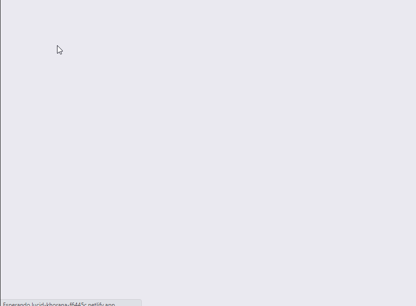
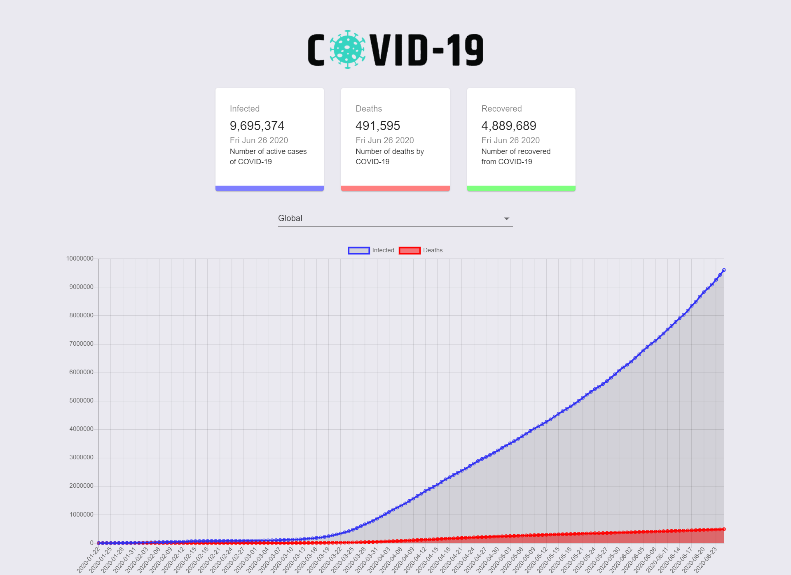
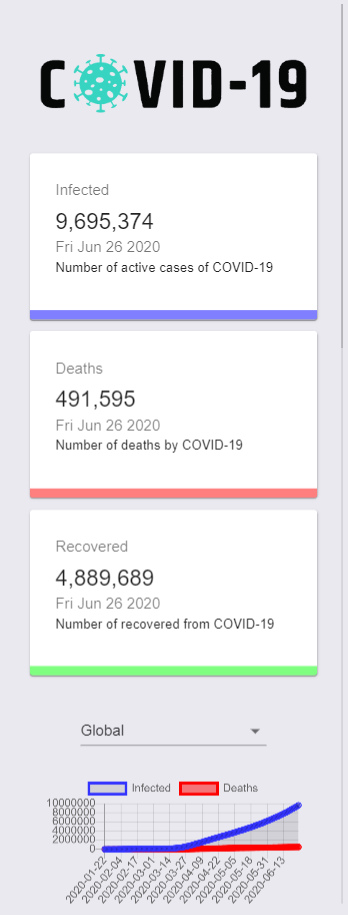
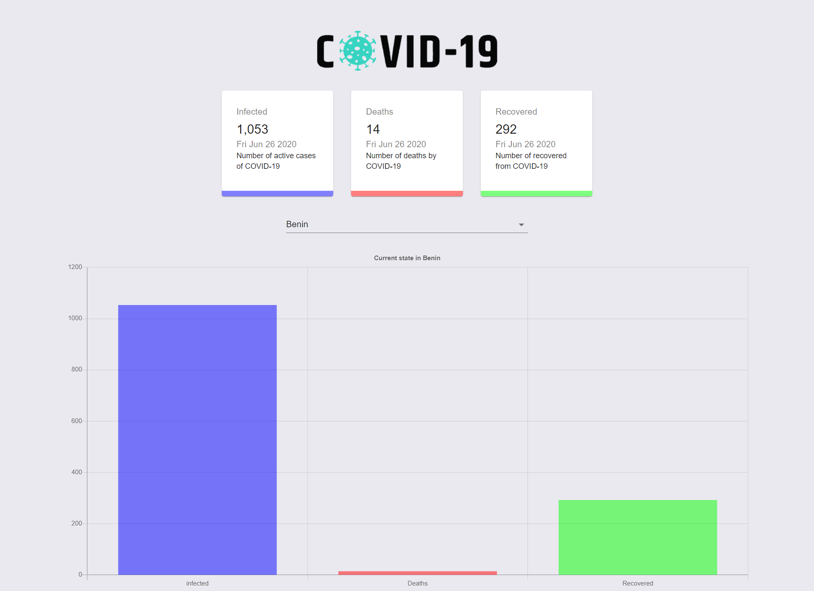
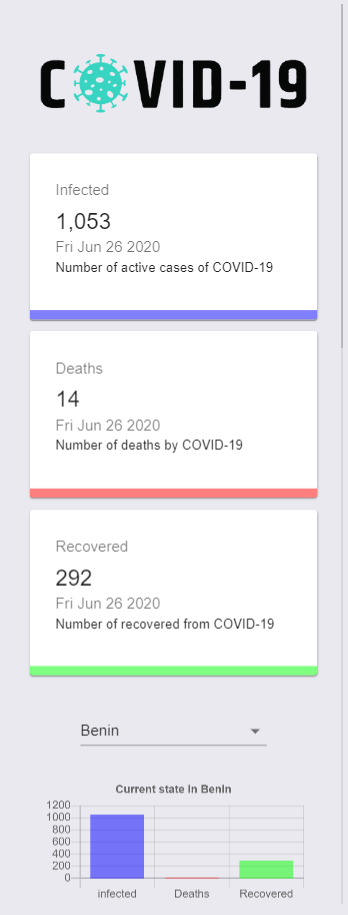

# COVID-19 TRACKER

_This is a practice develping frontend covid-19 tracker using react_

## Built with 🛠️

* [React](https://es.reactjs.org/) - A JavaScript library for building user interfaces.
* [Material-ui](https://material-ui.com/) - React components for faster and easier web development.
* [Chartjs](https://www.chartjs.org) - Simple yet flexible JavaScript charting for designers & developers.
* [Axios](https://www.npmjs.com/package/axios) - Promise based HTTP client for the browser and node.js.
* [React Countup](https://www.npmjs.com/package/react-countup) - A configurable React component wrapper around CountUp.js.

This project was bootstrapped with [Create React App](https://github.com/facebook/create-react-app).

## Options 

Can search covid data by country or global 

GLOBAL   

COUNTRY   

## Available Scripts

In the project directory, you can run:

### `yarn start`

Runs the app in the development mode. 
Open [http://localhost:3000](http://localhost:3000) to view it in the browser.

### `yarn test`

Launches the test runner in the interactive watch mode. 
See the section about [running tests](https://facebook.github.io/create-react-app/docs/running-tests) for more information.

### `yarn build`

Builds the app for production to the `build` folder. 
It correctly bundles React in production mode and optimizes the build for the best performance.

The build is minified and the filenames include the hashes. 
Your app is ready to be deployed!

See the section about [deployment](https://facebook.github.io/create-react-app/docs/deployment) for more information.

---
⌨️ with ❤️ by [cesarevc](https://github.com/cesarevc) 